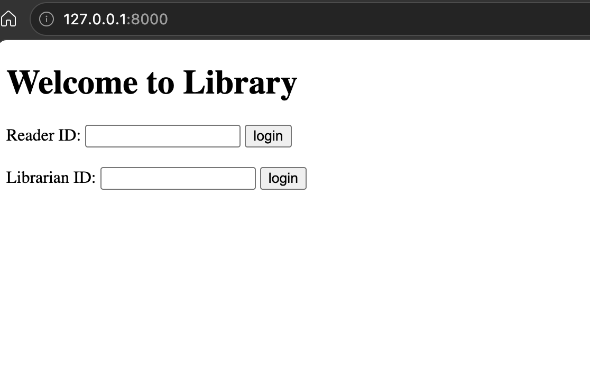
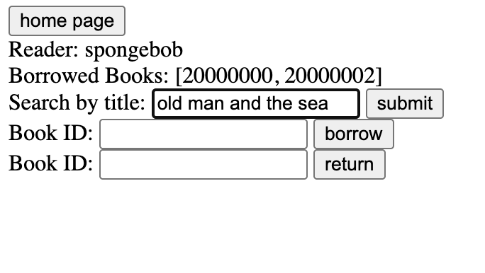
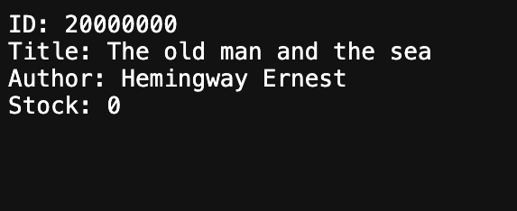
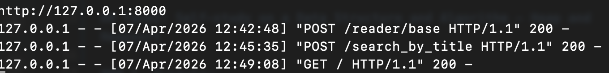
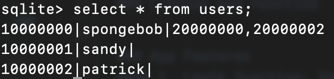
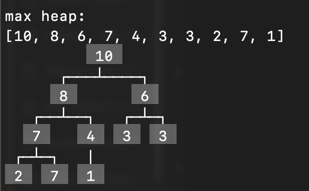
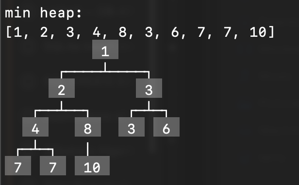

# COMP 2090SEF OOP Project

## Task1: Library Management System - Simple Web App

This is a library management system based on Object-Oriented Programming and minimal full-stack development. Functions including books borrowing and returning, searching, and adding and deleting. 

### The main conception of OOP:
#### 1. Classes and Objects
- `User`: parent of Reader and Librarian.
- `Reader`: borrowing/returning books and retrieving reader infomation.
- `Book`: title and stock, as well as searching strategies.
- `Librarian`: adding/deleting books.

#### 2. Encapsulation
- Privite attribute and method: `__database_conn` and `__update()`.
- Public methods: `load_by_title()`, `reduce_stock()`, `login()`, etc..

#### 3. Inheritance
- `Reader` and `Librarian` inherit `User`.

#### 4. Polymorphism
- `Reader` and `Librarian`: the methods in two classes `is_exist()` and `login()` perform differently.

### Classes and Function
- Reader: Manage ID and name, borrow/return methods.
- Book: Manage book title, author and stock.
- LibraryManager: Provides operations and manages bookes.

---

### App Features
#### 1. Login: You can select your identity for doing related businesses. <br>


#### 2. Searching a book by title



#### 3. HTTP server handling


#### 4. Sqlite3 connection


---

### Getting Start
1. Clone the repository to local or directly download all the files.
2. Run the "main.py" file directly under **task1** directory.
3. You will get the loop-back address:
    ```
    >> python3 main.py
    http://127.0.0.1:8000
    ```
4. Open it in your browser. <br>
    

---

## Task2: Self-study on a Data Structure and Algorithm - Heap and Heapsort

### 1. Overview
    **Heaps** - tree-based data structures. 

    **Heapsort** - a comparison-based sorting algorithm using a heap.

Max-heap: every parent node is greater than or equal to its children;<br>


Min-heap, every parent node is smaller than or equal to its children.<br>


### 2. Data Structure: Heap
- **ADT**: A heap is a complete binary tree. In a max-heap, parent nodes are larger than children. Main operations: build heap: O(n), heapify, insert: O(logn), extract root: O(logn).
- **Applications**: Priority queues, task scheduling, Dijkstra's algorithm.

### 3. Algorithm: Heap Sort
- **Idea**: Build a max heap, then repeatedly swap the root (largest) with the last element, reduce heap size, and heapify the root. This sorts the array in place.
- **Time Complexity**: O(n log n) for all cases. Space: O(1).

### 4. Code Implementation
- **`Heap`（Abstract Base Class)**: Defines the core architecture and shared logic, It handles universal operations like`build_heap`, `heapify`, `extract_root` and `insert`, and an optimized `pop` method(supporting deletion from any index).
- **`Max_heap` class**: Inherits from `Heap` and implements comparison logic where parents are larger than children.
- **`Min_Heap` class**: Inherits from `Heap` and implements comparison logic where parents are smaller than children.
- **`heapify`(Sift Down)**: Recursively restores heap property in O(logN); enables efficient O(N) initial heap construction.
- **Safety & Integrity**: The implementation ensures structural integrity through dual-adjustment (`sift_up` and `heapify`) during node removal.

### 6. File Structure
-  **`my_heap.py`**: Core logic including Heap base class and subclasses.
-  **`tree_printer.py`**: A helper module for terminal-based binary tree visualization.
-  **`requirements.txt`**: List of required third-party libraries.

### 5. Getting Started
- **Prerequisites**: Ensure you have Python 3.x installed.
- **Installation**: Install dependencies for visualization:
  `pip install -r requirements.txt`
- **Usage**: Run the main script to see the heap operations and visualization:
  `python my_heap.py `
